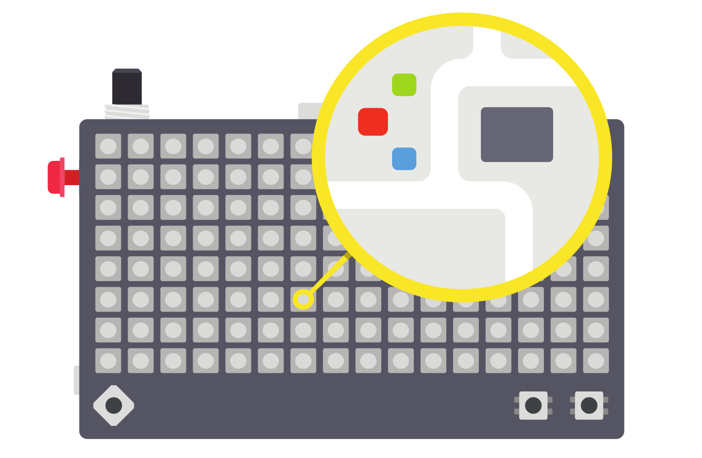
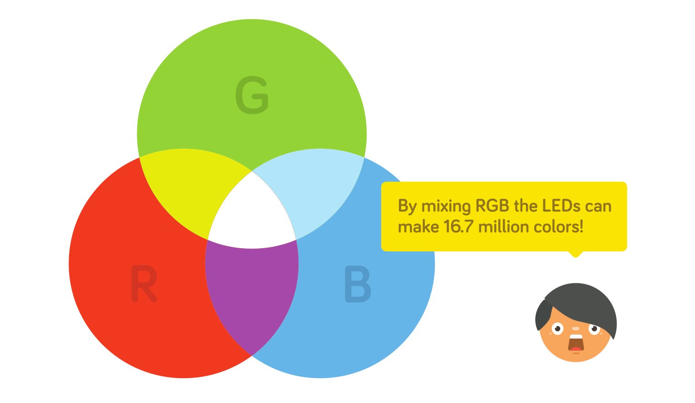
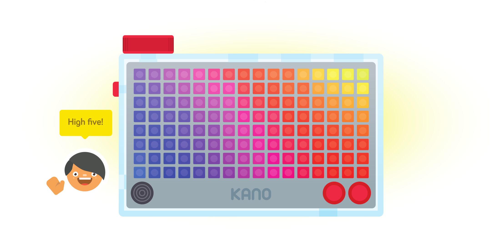

# Pixel Colors

What are colors made of? I don't mean how they look like but, what green is **made of**? In other words, what's in the clouds that makes them white or grey? Why are the leafs on a plant green but the flowers have so many other colors? And finally, the hardest question of all times: How do we know the green we see is the same as the green other people see?

Colors are a really funny thing to play with and play is the best way to try answering all the questions above! One way to do it is to get buckets of paint and splash around to see what happens when they get mixed or applied on different surfaces. The problem with this method is that after all this you will have to clean everything! Have you tried to remove paint from the carpet? That is not fun.

Luckly we can do almost everything we would do with paint but with light and you don't have to clean up light after you play with it! That sounds fun! Shall we try?

## Mixing Colors

If we were to mix paint, we would probably want to get hold of buckets of primary colors (red, yellow and blue) as we can make any colors by mixing them in the right proportions. But how about light? Well, light is no different except we don't have to "spend" any paint.

Instead of buckets of colors we have something called "RGB LEDs" (the white squares that shines on your Pixel Kit). Translating to full words, "RGB" stands for "Red, Green and Blue" and "LED" is "Light Emitting Diode". So basically RGB LEDs are Red, Green and Blue light emitters.

If we look very very close to the LEDs on your Pixel Kit you might notice that there are 3 other tiny LEDs inside one RGB LED: a Red, a Green and a Blue. Every color will be a mix of how bright are those 3 tiny LEDs.



When you turn your Pixel Kit on we can see a green dot with a yellow dot on top of it. Looking closer to it we will notice that on the green dot you can only see one tiny LED on (obviously the green one) but on the yellow dot you will see not only that the tiny green LED is not as bright as the green and there is also a red one shining under it. So if I ask you how to make yellow what are the colors you think we should mix?

## How Much of Each Color?

Now that we know we can mix red, green and blue there is one question left? How can we describe how much of each color should we add to our color? To begin with we need to understand that Pixel Turtle doesn't understand if we say "a tiny bit", "a little bit more" or "almost nothing" but it is really good with numbers! But what numbers? Can we use any numbers we like? Nope.

Pixel Turtle can only make colors with numbers from `0` to `255` and to be honest it doesn't like any numbers above `20` so we'll be creating colors with a mix of red, green and blue and we'll measure how much of each color with numbers from `0` to `20`. For example I like `5` for red, `10` for green and `12` for blue. But how do we tell the Pixel Turtle we want that color?



## Creating Pixel Colors

Besides [wandering around](./pixel-turtle-wandering.html), Pixel Turtles can change colors, which makes me think if it's really a turtle or a chameleon, but that is a different discussion. The way we ask for Pixel Turtle to change its color to the one I like (`5` for red, `10` for green and `12` for blue) is like this:

```python
import * from PixelTurtle
setColor([5, 10, 12])
```

Notice that we put the numbers in order, first red then green and finally blue, separated by `,` and wrapped on `[]`. More on that on a [different tutorial](./list-of-things.html).

What color is this and what tiny LEDs turn on for that color? Can you figure out how to make your favorite color?


